# ENTREGABLE DATAFLOW

## OBJETIVO
Implementar cámaras equipadas con Inteligencia Artificial para monitorizar la velocidad de los vehículos en secciones específicas, y multarlos en caso necesario.
<br>
<br>


## REQUISITOS
- Cada cámara se instalará en una sección particular y deberá calcular la velocidad promedio de cada vehículo.
- La velocidad promedio en la sección no debe exceder los 40 km/h.
- Se debe capturar una imagen, obtener el número de matrícula y almacenar la foto analizada de todos los vehículos multados.
<br>
<br>

## CONDICIONES
- Los datos capturados por diferentes cámaras deben enviarse al tema proporcionado durante la clase para la correcta visualización de los datos.
- Los datos también deben almacenarse en el Data Warehouse para un análisis posterior por parte del equipo de Analistas.
- El mensaje de notificación para multas ahora debe incluir la URL del Bucket de Google Cloud Storage donde se almacena la imagen del vehículo, para verificar  que el modelo haya capturado correctamente el texto de la matrícula.
<br>
<br>

## ARQUITECTURA

<br>
<br>

## SETUP PREVIO

1. **Conectarse al entorno de GCP:**
    ```bash
    gcloud init
    gcloud auth login
    gcloud auth application-default login
    gcloud services enable dataflow.googleapis.com
    gcloud services enable pubsub.googleapis.com
    gcloud services enable vision.googleapis.com
    gcloud services enable cloudbuild.googleapis.com
    ```

2. **Crear entorno virtual y conectarse:**
    ```bash
    python -m venv andrestest
    andrestest\Scripts\activate
    ```

3. **Instalar librerías:**
    ```bash
    pip install -U -r requirements.txt
    ```
<br>

## GENERADOR
La calle sobre la que haremos el estudio es en la Avenida Lexington, una calle importante de Manhattan y muy transitada. Las coordenadas del tramo son las siguientes:

- Coordenada_ini: 40.7128° N, 73.9790° W
- Coordenada_fin: 40.7431° N, 73.9824° W

Lanzamos el generador con esa ruta y comprobamos que se vayan generando rutas de coches en esa calle en el topic de pre-procesado. Se ha añadido un fragmento de código al generador para que de manera simultánea inserte los datos del topic en una tabla de BigQuery llamada pre-procesado.

### Generador

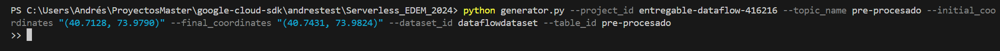

### Pre-Procesado

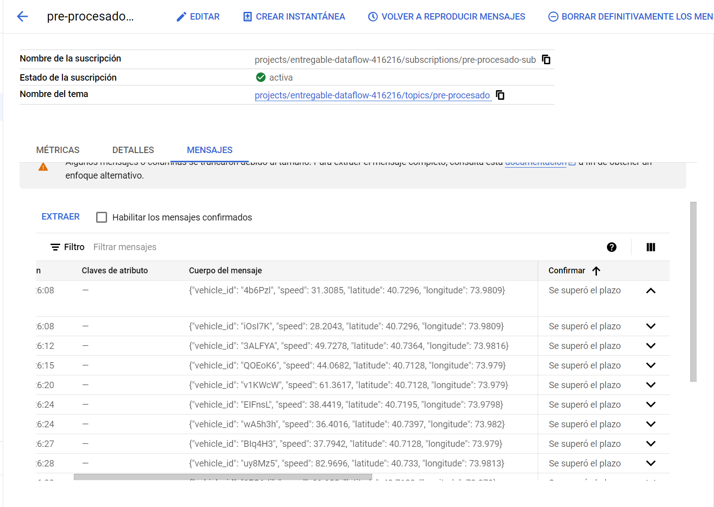

### Tabla en BigQuery (pre-procesado)

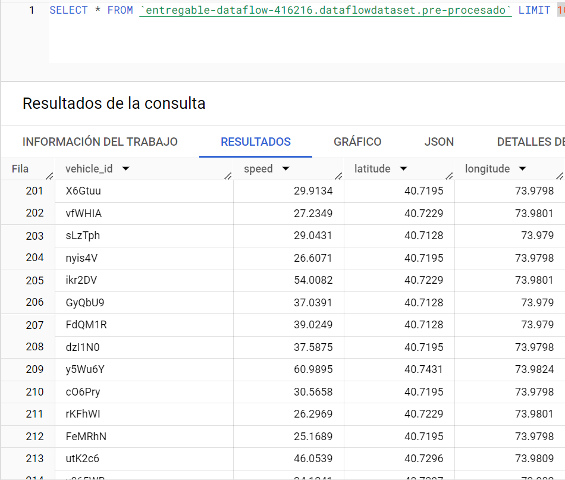

<br>
<br>

## DATAFLOW
- Lanzamos el pipeline.py correspondiente al despliegue en Dataflow de la siguiente manera:

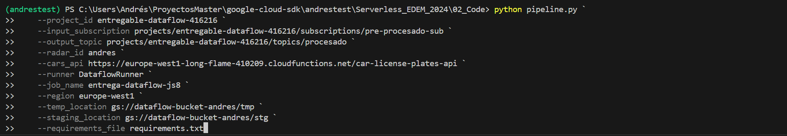

<br>

- Esto nos despliega el job correspondiente en Dataflow y ejecuta el pipeline:

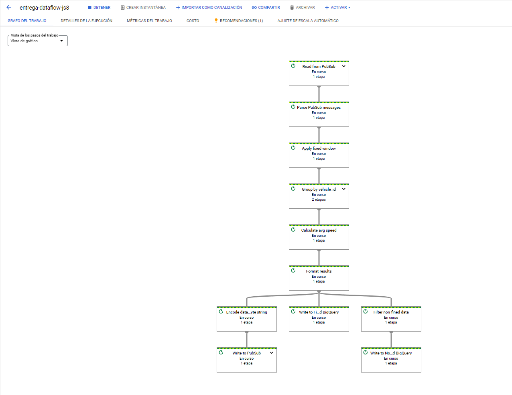

<br>

- Se generan los mensajes correspondientes en el topic de salida (procesado), con la velocidad media de cada vehículo en dicho tramo y si ha sido multado o no. A su vez, a los coches multados les genera una imagen de la API que hemos pasado como parámetro, simulando una captura de la cámara del radar. 
  
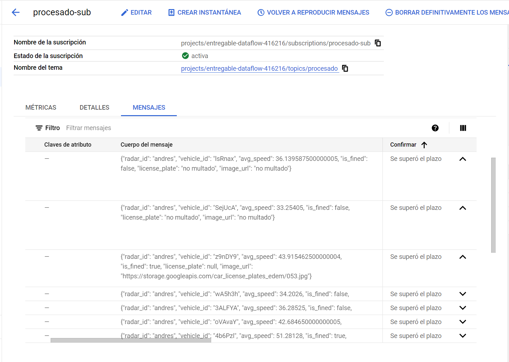

<br>

- Se insertan en bigquery todos los coches que se han ido registrando. Los no multados se insertan en la tabla "procesado-non-fined", mientras que los multados se insertan en la tabla "procesado-fined". De estos coches multados se extrae la matrícula de la imagen captada por la cámara y queda registrada en la tabla. 

### Multados

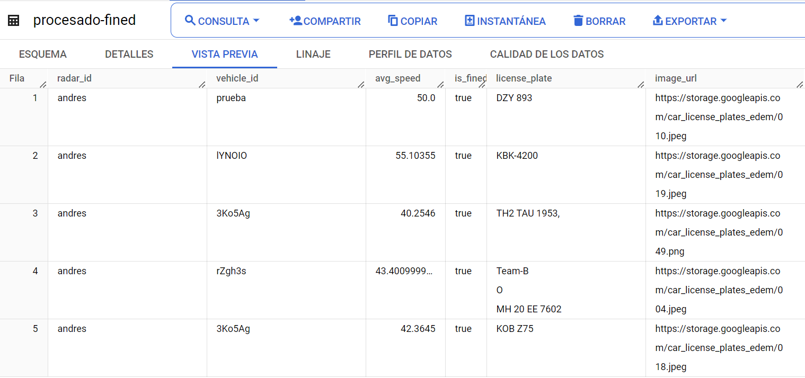

### No multados

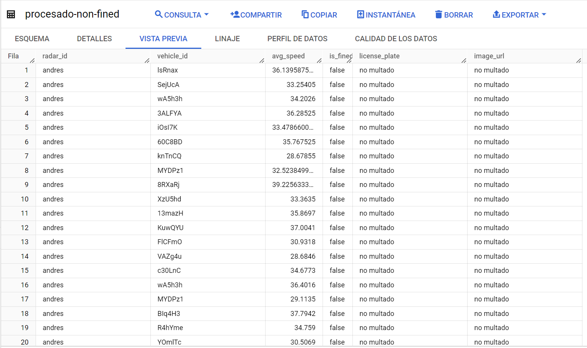

<br>
<br>

## COMPROBACIONES

Para terminar, se va a poner un ejemplo de un coche multado en concreto para observar la calidad del modelo.

### Procesado

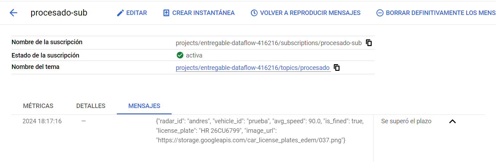

### Procesado-fined en BQ

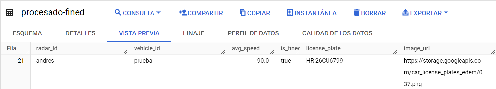

### Imagen captada por la cámara 

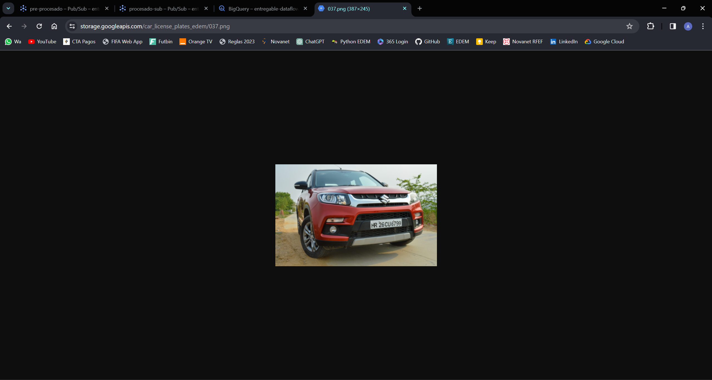

<br>

Vemos que el vehículo ha sido captado por la cámara con un exceso de velocidad en la media del tramo, ha sido registrado en la tabla de coches multados y la matrícula corresponde con la que se observa en la imagen captada por la cámara.