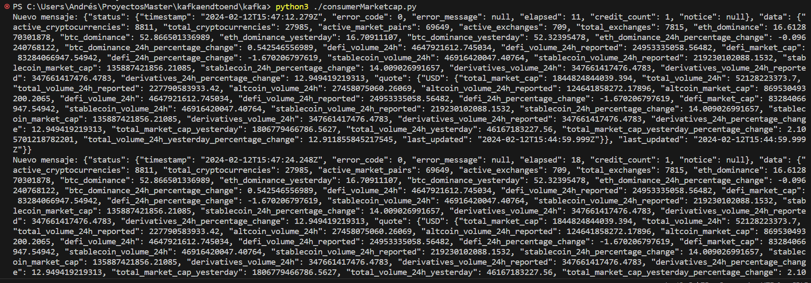
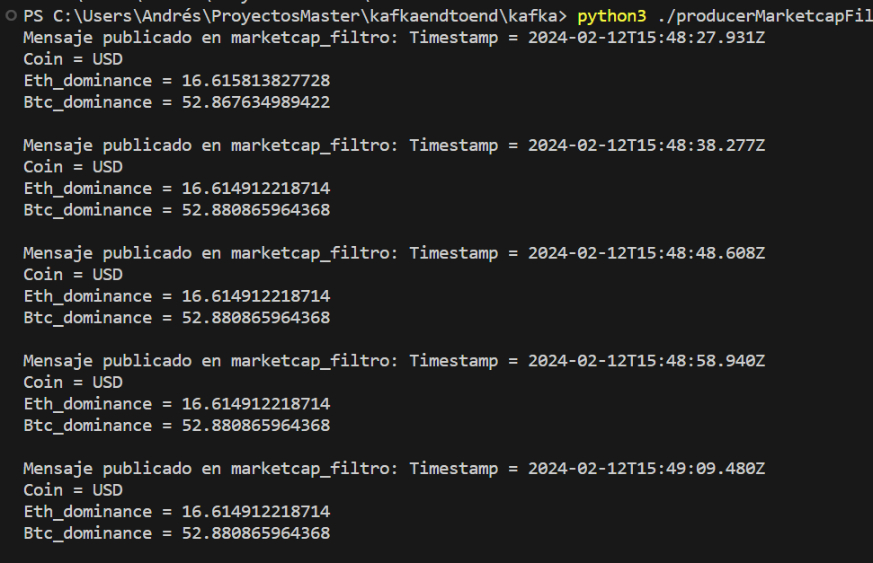
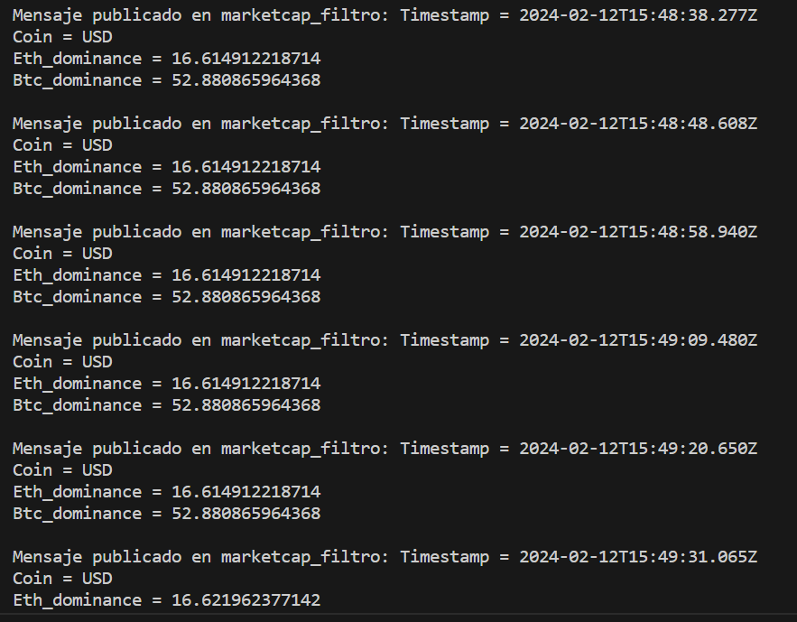

# APP PARA CLASIFICAR CRIPTOMONEDAS POR TIPO DE MONEDA USANDO KAFKA

1) Run docker-compose up -d
   
2) Lanzamos primer productor, que escribe el mensaje completo de la API sobre el topic marketcap --> run producer.py

   Lanzamos primer consumidor que lee ese topic --> run consumerMarketcap.py

   

3) Lanzamos segundo productor, que filtra los JSON del topic y los escribe sobre el topic marketcap_filtro --> run producerMarketcapFiltered.py
   
   Lo consumimos para ver el mensaje filtrado --> run consumerMarketcapFiltered.py

   

4) Lanzamos KSQL y mandamos al topic marketcap_usd_stream los mensajes con valor Coin = 'USD' 
   
    KSQL --> docker-compose exec ksql-cli ksql http://host.docker.internal:8088

    CREATE STREAM MARKETCAP_FILTRO_STREAM (Timestamp VARCHAR, Coin VARCHAR, Eth_dominance DOUBLE, Btc_dominance DOUBLE) \
    WITH (KAFKA_TOPIC='marketcap_filtro', VALUE_FORMAT='JSON'); --> Creamos el stream asociado al topic origen

    CREATE STREAM MARKETCAP_USD_STREAM AS \
    SELECT * FROM MARKETCAP_FILTRO_STREAM \
    WHERE Coin = 'USD'; --> Creamos el stream final con los valores de Coin que nos interesan

5) Consumimos el topic y vemos el resultado final --> run ./consumerUSD.py

    